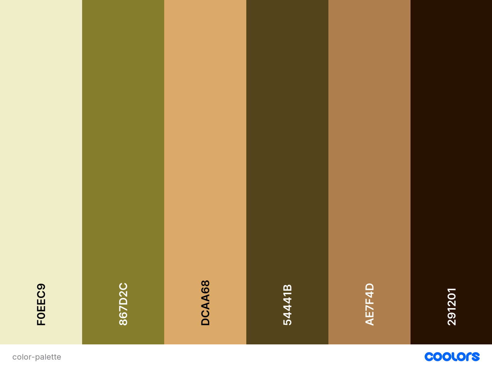

# Khoisan People 

The website is about the historic origins of the Khoisan people who are known to be the first settlers of South Africa. The websites display historical story about the tribe of Khoisan people. This is portrayed in content, images, video, and resources to learn more are given, in a form of, tourist attraction places to visit. Last, links to other websites for more information is given. 

![Website look][def]
[Website Link][def]

## Table of Content
1. [Site Owner Goal](#site-owner-goal)
2. [User Experience](#user-experience)  
3. [Color Scheme Used](#color-scheme-used)
4. [Typography](#typography)
5. [Wireframe](#wireframe)
    1. [Home](#home)
    2. [Gallery](#gallery)
    3. [About Us](#about-us)
    4. [Mobile version](#mobile-version)
6. [Features](#features)
    1. [General](#general)
7. [Technologies](#technologies)
    1. [Code Language](#technologies)
    2. [Frameworks and libraries](#technologies)
    3. [General](#technologies)
    4. [Technologies used for testing](#)
8. [Testing](#testing)
    1. [Testing User Stories](#)
    2. [Code Validation](#)
    3. [Accessibility](#)
    4. [Manual Testing](#)
    5. [Bug found during testing](#)
9. 
10. 
11. [Future Addition](#future-addition)
12. 
13. [Acknowledgement](#acknowledgement)
14. 
15. [Frameworks and libraries](#frameworks-and-libraries)

## Site Owner Goal 

* The purpose of the website is to tell a story about the tribe of Khoisan people. 
* Take the user on an informative journey about the historic origin of Khoisan People. 
* Show historical true events with picture, videos, and existing tourist sites to visit to learn more.  

## User Experience  

* Take users on a historic journey about the Khoisan People.  
* Display informative information, with descriptive pictures about caves, artefacts, traces they left behind.  
* Educate the user who want to know more. 
* Offer tourist attraction places that user can visit to learn more. 

## User Story 
* As a user I want to navigate the website that tells a story from beginning to end.  
* I want to read information about the story told. 
* I want to see pictures and videos of the story told.  
* I want to be provided with resources to learn more.  
* I want to know more about tourist attraction to discover more in person. 
* I want to follow social media for more activities.  
* I want to know the location of the office if I decide to visit in person. 
* I want to get in touch with the website content provider. 
* I want to give feedback or ask questions. 
* I want contact details to post or write my feedback or questions 
 
[Table of Content](#table-of-content) :arrow_up:  

## Color Scheme Used 
Choose soft colors that represent the safari and nature that surround the Khoisan people. I used Hex formating for colors on CSS 

 

* __#F0EEC9__ - Is used as a background color. 
* __#DCAA68__ - Is used to highlight when hovering over responsive features.  
* __#AE7F4D__ - Is used for the header and footer background color. 
* __#180A00__ - Is used for the font.  
* __#867D2C__ - Used on the form.  
* __#54441B__ - Used on visited links
* __#FFF__ - Font color on footer and on hover for the menu bar

## Typography
Google fonts **Courgette** pared with **Libre Baskerville** has been used and **serif**  used as a fall back. 

## Wireframe 

 
### Home
* Shows the brief description of the website. 
* By explaining the purpose of the website. 
* Giving a brief explaination about the website content. 

 
### Gallery
* Pictures telling a story with brief description. 
* Tourist attractions for more information. 
* Links to online resources for further knowledge.  

 
### About Us
* Shows a feedback form, video, office postal address, contact details, and map location. 

 
### Mobile version 
* Responsive mobile version 

[Table of Content](#table-of-content) :arrow_up:

## Features 

All the information displayed on the website and technologies used to create it.  

### General  

*Header and footer* – Are the same across all pages.  

 

*Header* – It contains navigation bar and responsive website logo - leading to home page across all pages. In the initially design the logo and menu bar were supposed be opposite each other, but because of lack of knowledge and time I had to make two seperate containers for both. This was easier to design. Because of this choice the two are on the opposite end of view port to each other. 

 

*Footer* – It contains social media icons and "Educational Purposes" statement.  

*Home Page* – is brief description of the website and content. 

*Gallery* – is pictures telling a story, with brief description and links for further resources. And tourist attraction to learn more in person. 

*About us* – has a video, office location map, contact details, and a feedback form. 

*Submission page* – a "Thank you" for submitting form statement. 

[Table of Content](#table-of-content) :arrow_up:

## Technologies 

### Code Language
* __HTML__ – code structure  
* __CSS__ – styling  

### Frameworks and libraries 

* [Google Fonts](https://fonts.google.com/)– choice of font to go with theme 
* [Font Awesome](https://fontawesome.com/)– social media icons 
* [GitPod](https://gitpod.io/)– platform to write the code 
* __Gitflow__ – progress for the creation of website 
* [GitHub](https://github.com/)– file code is displayed
* [Balsamiq](https://balsamiq.com/)– created the framework 
* __Heroku__ - deployed the website

### General  

* Content 
    * npr.org
    * Wikipedia
    * medium.com 
    * Youtube
* Images
    * flickr.com
    * stock.adobe.com
    * istockphoto.com
    * Canvas
* Code
    * [Stack Overflow](https://stackoverflow.com/) 
    * [W3Schools](https://www.w3schools.com/) 
    * 
* Watermark remover - used apeaksoft.com to remove watermark on images.
* Image Compressor - used [TinyPNG](https://tinypng.com/) to compress images.
* coolors.co - choosing the color palette.
* All platform look - used [Am I Responsive?](http://ami.responsivedesign.is/#) to create a sample accross all view point from different sreen size 

### Technologies used for testing 
* [Responsive Design Checker](https://www.responsivedesignchecker.com/) – responsiveness  
* [W3C Markup Validator](https://validator.w3.org/)– code error  
* [W3C CSS Validator](https://jigsaw.w3.org/css-validator/)– code error  
* [Chrome DevTools](https://developer.chrome.com/docs/devtools)– check and test CSS across building process 
* __AM I responsive__ – used to check responsiveness of images 

[Table of Content](#table-of-content) :arrow_up:

## Testing 

The testing story accross all pages.

### Testing User Stories

### Code Validation

### Accessibility

### Manual Testing

### Bug found during testing  

Bugs    | Resolution    | Not Resolved
---     | ---           | ---
*       |               | 
*       |               |
*       |               |