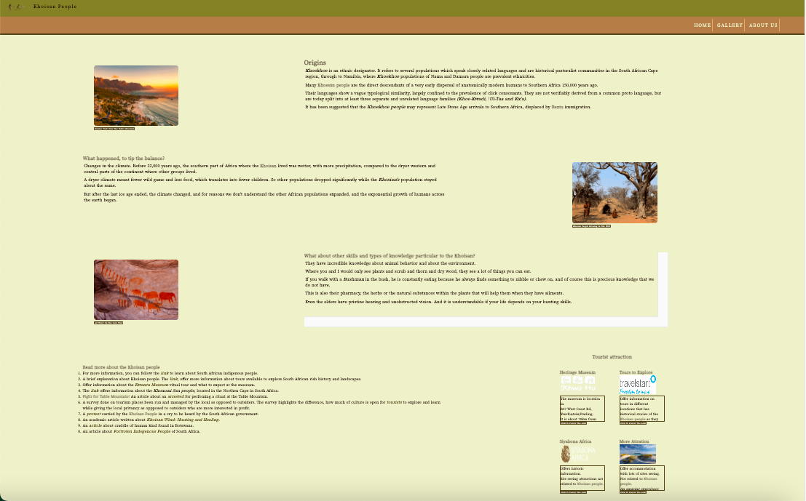

 

# Khoisan People 

The website is about the historic origins of the Khoisan people who are known to be the first settlers of South Africa. The websites display historical story about the tribe of Khoisan people. This is portrayed in content, images, video, and resources to learn more are given, in a form of, tourist attraction places to visit. Last, links to other websites for more information is given. 

![Website look][def]
[Website Link][def]

## Table of Content
1. [Site Owner Goal](#site-owner-goal)
2. [User Experience](#user-experience)  
3. [Color Scheme Used](#color-scheme-used)
4. [Typography](#typography)
5. [Wireframe](#wireframe)
    1. [Home](#home)
    2. [Gallery](#gallery)
    3. [About Us](#about-us)
    4. [Mobile version](#mobile-version)
6. [Features](#features)
    1. [General](#general)
7. [Technologies](#technologies)
    1. [Code Language](#technologies)
    2. [Frameworks and libraries](#technologies)
    3. [General](#technologies)
    4. [Technologies used for testing](#technologies-used-for-testing)
8. [Testing](#testing)
    1. [Testing User Stories](#testing-ser-tories)
        1. [Home Page](#home-page)
        2. [Gallery Page](#gallery-page)
        3. [About Us Page](#about-us-page)
        4. [Submission Page](#submission-page)
        5. [CSS Styling Across All Pages](#css-styling-across-all-pages)
13. [Code Validation](#code-validation)

## Site Owner Goal 

* The purpose of the website is to tell a story about the tribe of Khoisan people. 
* Take the user on an informative journey about the historic origin of Khoisan People. 
* Show historical true events with picture, videos, and existing tourist sites to visit to learn more.  

## User Experience  

* Take users on a historic journey about the Khoisan People.  
* Display informative information, with descriptive pictures about caves, artefacts, traces they left behind.  
* Educate the user who want to know more. 
* Offer tourist attraction places that user can visit to learn more. 

## User Story 
* As a user I want to navigate the website that tells a story from beginning to end.  
* I want to read information about the story told. 
* I want to see pictures and videos of the story told.  
* I want to be provided with resources to learn more.  
* I want to know more about tourist attraction to discover more in person. 
* I want to follow social media for more activities.  
* I want to know the location of the office if I decide to visit in person. 
* I want to get in touch with the website content provider. 
* I want to give feedback or ask questions. 
* I want contact details to post or write my feedback or questions 
 
[Table of Content](#table-of-content) :arrow_up:  

## Color Scheme Used 
Choose soft colors that represent the safari and nature that surround the Khoisan people. I used Hex formating for colors on CSS 

 

* __#F0EEC9__ - Is used as a background color. 
* __#DCAA68__ - Is used to highlight when hovering over responsive features.  
* __#AE7F4D__ - Is used for the header and footer background color. 
* __#180A00__ - Is used for the font.  
* __#867D2C__ - Used on the form.  
* __#54441B__ - Used on links and borders.
* __#FFF__ - Font color on footer and on hover for the menu bar

## Typography
Google fonts **Courgette** pared with **Libre Baskerville** has been used and **serif**  used as a fall back. 

## Wireframe 

### Home
* Shows the brief description of the website. 
* By explaining the purpose of the website. 
* Giving a brief explaination about the website content. 
 

### Gallery
* Pictures telling a story with brief description. 
* Tourist attractions for more information. 
* Links to online resources for further knowledge.  
 

### About Us
* Shows a feedback form, video, office postal address, contact details, and map location. 
 

### Mobile version 
* Mobile design initial idea.
 
[Table of Content](#table-of-content) :arrow_up:

## Features 

All the information displayed on the website and technologies used to create it.  

### General  

*Header and footer* – Are the same across all pages.  

*Header* – It contains navigation bar and responsive website logo - leading to home page across all pages. In the initially design the logo and menu bar were supposed be opposite each other, but because of lack of knowledge and time I had to make two seperate containers for both. This was easier to design. Because of this choice the two are on the opposite end to each other. 
 

*Footer* – It contains social media icons and "Educational Purposes" statement. On the initial design it was meant to all be inline. However for the lack of knowledge and time constrains I have made the statement and social media icons to be on the center.  
 

*Home Page* – is brief description of the website and content. 

*Gallery* – is pictures telling a story, with brief description and links for further resources. And tourist attraction to learn more in person. 

*About us* – has a video, office location map, contact details, and a feedback form. 

*Submission page* – a "Thank you" for submitting form statement. 

[Table of Content](#table-of-content) :arrow_up:

## Technologies 

### Code Language
* __HTML__ – code structure  
* __CSS__ – styling  

### Frameworks and libraries 

* [Google Fonts](https://fonts.google.com/)– Used for choice of font to go with theme. 
* [Font Awesome](https://fontawesome.com/)– Used for social media icons. 
* [GitPod](https://gitpod.io/)– Used for the platform to write the code. 
* [GitHub](https://github.com/)– Used for building progress for the website and file code is displayed on.
* [Balsamiq](https://balsamiq.com/)– Used to create the framework. 
* [Heroku](https://www.heroku.com/) - Used to deploy the website

### General  

* Content 
    * npr.org
    * Wikipedia
    * medium.com 
    * Youtube
* Images
    * flickr.com
    * stock.adobe.com
    * istockphoto.com
    * Canvas
* Code
    * [Stack Overflow](https://stackoverflow.com/) 
    * [W3Schools](https://www.w3schools.com/) 
* Watermark remover - used [apeaksoft.com](https://apeaksoft.com/) to remove watermark on images.
* Image Compressor - used [TinyPNG](https://tinypng.com/) to compress images.
* For the colour palette - used [Coolors.co](https://coolors.co/) - choosing the color palette.
* All platform look - used [Am I Responsive?](http://ami.responsivedesign.is/#) to create a sample accross all different sreen sizes. 

### Technologies used for testing 
* [Responsive Design Checker](https://www.responsivedesignchecker.com/) – responsiveness  
* [W3C Markup Validator](https://validator.w3.org/)– code error  
* [W3C CSS Validator](https://jigsaw.w3.org/css-validator/)– code error  
* [Chrome DevTools](https://developer.chrome.com/docs/devtools)– check and test CSS across building process 
* __Lighthouse__ – used to test the website. 

[Table of Content](#table-of-content) :arrow_up:

## Testing 

The testing story accross all pages.

### Testing User Stories

### Home Page 
* The user can navigate through with responsive menu bar and footer.
* The user can use the website logo to go back to the main page.
* Each link opens a new tab, to make sure the user doe not get lost.
* The user can use the social media icons to follow the updates about the website.
* The header and footer is the same across all viewport sizes and all pages.

### Gallery Page 
* The user can navigate by clicking on the links for extra information.
* All images are responsive on hover.
* All pages lead to a new page.
* The user can use the scrow bar to read through the overflow content.

### About Us Page 
* The user can decide when to play the video.
* The user can navigate the office direction on google map.
* The form is responsive on focus. 
* Submitting the feedback form leads to a "thank you" page.

### Submission Page 
* The user can use the menu bar and social media icons to navigate back to previous pages. 
* __For Future__ - The logo image is not positioned properly. Because of lack of time, did not have the chance to work on the similor positioning to the rest of the pages. In the next release it would have similor look to other pages. 

## Code Validation
__Home Page__ - Full passed the test.

__Gallery Page__ - Full passed the test.

__About Us Page__ - Iframe tag require some debugging. Did not have enough time and would be implemented in the nest release.

__Submission Page__ - The logo position was not responsive to the style. Did not have enough time and would be implemented in the nest release.

__CSS Styling For All Pages__ - There ar a few errors found. Did not have enough time and would be implemented in the nest release.

